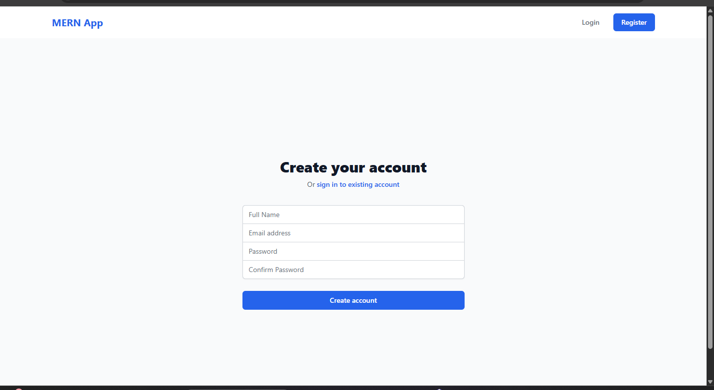
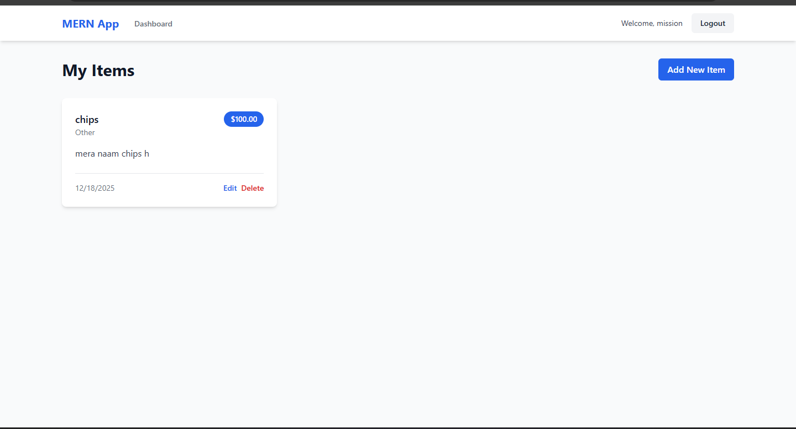
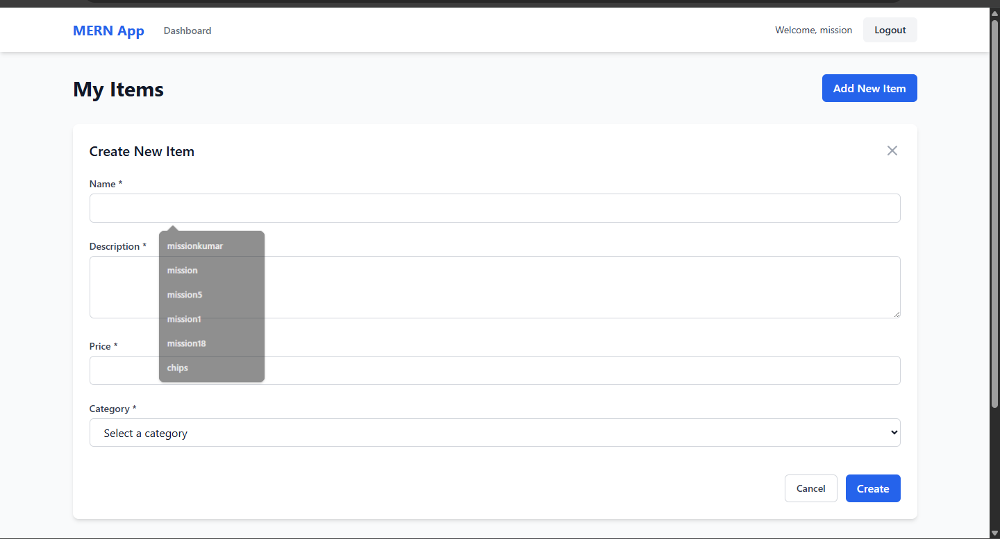
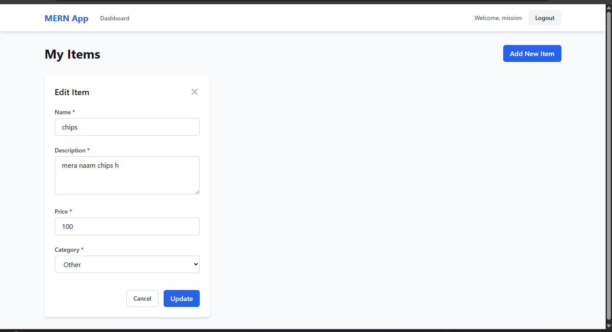

🚀 MERN Stack with Vite - Complete CRUD & Auth Application
📋 Table of Contents
Overview

📸 Application Screenshots

## 🔐 Authentication
### Login

### Register

## 🏠 Dashboard

## ✏️ CRUD Operations
### Create Item

### Edit Item

Features

Tech Stack

Project Structure

Installation

Configuration

Running the Application

API Documentation

Application Screenshots

Troubleshooting

Contributing

🌟 Overview
A full-stack MERN application with modern development tools including Vite for frontend, Tailwind CSS for styling, and Context API for state management. The application features complete authentication and CRUD operations with a clean, responsive UI.

✨ Features
✅ Authentication
User Registration with validation

Secure Login with JWT tokens

Protected Routes

Password encryption using bcryptjs

Persistent login sessions

✅ CRUD Operations
Create, Read, Update, Delete Items

User-specific data isolation

Real-time updates with Context API

Form validation

Image upload support

✅ Modern Stack
Backend: Node.js + Express + MongoDB

Frontend: React 18 with Vite

Styling: Tailwind CSS

State Management: React Context API

Routing: React Router v6

Build Tool: Vite (Fast Development)

🛠️ Tech Stack
Backend:

Node.js

Express.js

MongoDB + Mongoose

JWT Authentication

Bcrypt for password hashing

CORS enabled

Frontend:

React 18

Vite (Build Tool)

Tailwind CSS

Axios for HTTP requests

React Router DOM v6

Context API

📁 Project Structure
text
mern-vite-app/
├── 📂 backend/                 # Backend Server
│   ├── 📂 src/
│   │   ├── 📂 config/         # Database configuration
│   │   ├── 📂 controllers/    # Route controllers
│   │   ├── 📂 middleware/     # Authentication middleware
│   │   ├── 📂 models/         # MongoDB models
│   │   ├── 📂 routes/         # API routes
│   │   ├── 📂 utils/          # Utility functions
│   │   └── server.js          # Express server
│   ├── .env                   # Environment variables
│   ├── package.json           # Backend dependencies
│   └── package-lock.json
│
├── 📂 frontend/               # Frontend Application
│   ├── 📂 src/
│   │   ├── 📂 components/     # React components
│   │   │   ├── 📂 auth/       # Authentication components
│   │   │   ├── 📂 items/      # CRUD components
│   │   │   ├── 📂 layout/     # Layout components
│   │   │   └── 📂 common/     # Shared components
│   │   ├── 📂 context/        # Context API providers
│   │   ├── 📂 services/       # API services
│   │   ├── App.jsx            # Main App component
│   │   ├── main.jsx           # Entry point
│   │   └── index.css          # Global styles
│   ├── index.html             # HTML template
│   ├── package.json           # Frontend dependencies
│   ├── vite.config.js         # Vite configuration
│   ├── tailwind.config.js     # Tailwind configuration
│   └── postcss.config.js      # PostCSS configuration
│
├── .gitignore                 # Git ignore file
├── README.md                  # This file
└── package.json              # Root package.json
🚀 Installation
Prerequisites
Node.js (v16 or higher)

MongoDB (Local or MongoDB Atlas)

Git

Step-by-Step Setup
Clone or Create Project

bash
# Create project directory
mkdir mern-vite-app
cd mern-vite-app

# Initialize root package.json
npm init -y
Backend Setup

bash
# Navigate to backend directory
mkdir backend
cd backend

# Initialize backend
npm init -y

# Install backend dependencies
npm install express mongoose bcryptjs jsonwebtoken cors dotenv express-async-handler
npm install -D nodemon

# Create folder structure
mkdir -p src/{config,controllers,middleware,models,routes,utils}
Frontend Setup

bash
# Return to root and create frontend
cd ..
mkdir frontend
cd frontend

# Create Vite React app
npm create vite@latest . -- --template react

# Install additional dependencies
npm install axios react-router-dom
npm install -D tailwindcss postcss autoprefixer

# Initialize Tailwind CSS
npx tailwindcss init -p
Root Level Setup

bash
# Return to root directory
cd ..

# Install concurrently to run both servers
npm install concurrently

# Install all dependencies at once
npm run install-all
⚙️ Configuration
1. Backend Environment (.env)
Create backend/.env file:

env
PORT=5001
MONGO_URI=mongodb+srv://<username>:<password>@cluster0.mongodb.net/mern_app?retryWrites=true&w=majority
JWT_SECRET=your_super_secret_jwt_key_change_this_in_production
NODE_ENV=development
2. Backend Package.json
Update backend/package.json:

json
{
  "name": "backend",
  "version": "1.0.0",
  "type": "module",
  "scripts": {
    "start": "node src/server.js",
    "dev": "nodemon src/server.js"
  },
  "dependencies": {
    "bcryptjs": "^2.4.3",
    "cors": "^2.8.5",
    "dotenv": "^16.3.1",
    "express": "^4.18.2",
    "express-async-handler": "^1.2.0",
    "jsonwebtoken": "^9.0.2",
    "mongoose": "^7.5.0"
  },
  "devDependencies": {
    "nodemon": "^3.0.1"
  }
}
3. Frontend Vite Config
Update frontend/vite.config.js:

javascript
import { defineConfig } from 'vite'
import react from '@vitejs/plugin-react'

export default defineConfig({
  plugins: [react()],
  server: {
    port: 5173,
    proxy: {
      '/api': {
        target: 'http://localhost:5001',
        changeOrigin: true,
      },
    },
  },
})
4. Frontend Tailwind Config
Update frontend/tailwind.config.js:

javascript
/** @type {import('tailwindcss').Config} */
export default {
  content: [
    "./index.html",
    "./src/**/*.{js,ts,jsx,tsx}",
  ],
  theme: {
    extend: {},
  },
  plugins: [],
}
5. Root Package.json
Create package.json in root:

json
{
  "name": "mern-vite-app",
  "version": "1.0.0",
  "scripts": {
    "start": "concurrently \"npm run server\" \"npm run client\"",
    "server": "cd backend && npm run dev",
    "client": "cd frontend && npm run dev",
    "install-all": "npm install && cd backend && npm install && cd ../frontend && npm install",
    "dev": "npm start"
  },
  "devDependencies": {
    "concurrently": "^8.2.0"
  }
}
🏃‍♂️ Running the Application
Development Mode
bash
# Install all dependencies first
npm run install-all

# Start both frontend and backend
npm start
Access URLs
Frontend: http://localhost:5173

Backend API: http://localhost:5001

Verify Installation
Check console output for:

text
[0] Server running on port 5001
[0] MongoDB Connected: cluster0.mongodb.net
[1] VITE v4.4.5 ready in 854 ms
[1] → Local: http://localhost:5173/
[1] → Network: use --host to expose
📡 API Documentation
Authentication Endpoints
Method	Endpoint	Description	Auth Required
POST	/api/auth/register	Register new user	No
POST	/api/auth/login	Login user	No
GET	/api/auth/profile	Get user profile	Yes
Item Endpoints (All require authentication)
Method	Endpoint	Description
GET	/api/items	Get all user's items
GET	/api/items/:id	Get single item
POST	/api/items	Create new item
PUT	/api/items/:id	Update item
DELETE	/api/items/:id	Delete item
Request/Response Examples
Register User:

json
POST /api/auth/register
{
  "name": "John Doe",
  "email": "john@example.com",
  "password": "password123"
}

Response:
{
  "_id": "user_id",
  "name": "John Doe",
  "email": "john@example.com",
  "token": "jwt_token"
}
Create Item:

json
POST /api/items
{
  "name": "Laptop",
  "description": "Gaming laptop",
  "price": 1200,
  "category": "Electronics"
}

Response:
{
  "_id": "item_id",
  "name": "Laptop",
  "description": "Gaming laptop",
  "price": 1200,
  "category": "Electronics",
  "user": "user_id"
}
📸 Application Screenshots
🔐 Authentication Pages
Login Page
https://via.placeholder.com/800x450/3b82f6/ffffff?text=Login+Page

Clean, modern login interface

Form validation

Link to registration page

Registration Page
https://via.placeholder.com/800x450/10b981/ffffff?text=Registration+Page

User registration form

Password confirmation

Real-time validation

🏠 Dashboard & CRUD Operations
Dashboard
https://via.placeholder.com/800x450/8b5cf6/ffffff?text=Dashboard

Welcome message with user name

List of user's items

Add New Item button

Edit/Delete options

Create New Item
https://via.placeholder.com/800x450/f59e0b/ffffff?text=Create+New+Item

Modal form for adding items

Category dropdown

Price input with validation

Edit Item
https://via.placeholder.com/800x450/ef4444/ffffff?text=Edit+Item

Pre-filled form with existing data

Update functionality

Cancel option

Item List
https://via.placeholder.com/800x450/06b6d4/ffffff?text=Item+List

Card-based item display

Category tags

Price display

Action buttons

🐛 Troubleshooting
Common Issues & Solutions
1. Port Already in Use
bash
# Find process using port
sudo lsof -i :5001
# Kill process
kill -9 <PID>
2. MongoDB Connection Error
Check .env file for correct MONGO_URI

Whitelist IP in MongoDB Atlas

Use local MongoDB: mongodb://localhost:27017/mern_app

3. CORS Errors
Verify CORS configuration in server.js:

javascript
app.use(cors({
  origin: 'http://localhost:5173',
  credentials: true,
}));
4. JWT Token Issues
Ensure JWT_SECRET is set in .env

Check token storage in localStorage

Verify token expiration

5. Vite Proxy Issues
Check vite.config.js:

javascript
proxy: {
  '/api': {
    target: 'http://localhost:5001', // Must match backend port
    changeOrigin: true,
  },
}
Development Commands
bash
# Install all dependencies
npm run install-all

# Run in development mode
npm run dev

# Run backend only
npm run server

# Run frontend only
npm run client

# Check backend logs
cd backend && npm run dev

# Check frontend logs
cd frontend && npm run dev
🤝 Contributing
Fork the repository

Create a feature branch

Commit your changes

Push to the branch

Open a Pull Request

Code Style Guidelines
Use ES6+ JavaScript features

Follow React hooks best practices

Use Tailwind CSS utility classes

Maintain consistent folder structure

Add comments for complex logic

📝 License
This project is licensed under the MIT License - see the LICENSE file for details.

🙏 Acknowledgments
Vite for fast development

Tailwind CSS for styling

React for UI components

MongoDB for database

Express for backend framework

📞 Support
For support, email: support@example.com or create an issue in the repository.

⭐ Star this repository if you find it helpful!

🔄 Check for updates regularly as the tech stack evolves.

🐛 Report any issues you encounter for quick fixes.

Made with ❤️ by [Your Name/Organization]